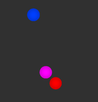

# Creating and visualizing the points
1. Run `python __main__.py` to create `point_cloud.bag`.
2. Open RViz with the Fixed Frame set to "base" and create a PointCloud2
   visualization with the topic set to "/points".
   

   
   

3. Run `rosbag play -l point_cloud.bag` to publish the point cloud on a loop.
   

   
   

